# Obesity Trends in India
## A State-wise Analysis of Lifestyle and Socioeconomic Factors
### Based on NFHS-5 (2019-20) Data

## Project Overview

This project analyzes obesity prevalence across 36 states and Union Territories of India using the 
National Family Health Survey-5 (NFHS-5) 2019-20 data. The analysis explores the relationship between 
obesity and key lifestyle factors (tobacco, alcohol, internet usage) and socioeconomic factors 
(education, income) at the state level.

Obesity is measured using the NFHS-5 indicator for overweight/obese adults (BMI ≥25.0 kg/m²), 
consistent with ICMR guidelines for Asian Indians where metabolic complications manifest at 
lower BMI levels than Western populations.

Per capita income data is sourced from Press Information Bureau (PIB) 2022-23 as the most recent
available state-level income data.

## Data Sources

| Source | Details |
|---|---|
| **NFHS-5 (2019-20)** | National Family Health Survey, Ministry of Health and Family Welfare, Government of India |
| **PIB (2022-23)** | Per Capita Income, Press Information Bureau, Government of India |
| **Zone Classification** | Zonal Councils, States Reorganisation Act 1956, Ministry of Home Affairs, Government of India |

## Data Coverage

| Parameter | Details |
|---|---|
| **Geographic Coverage** | 36 States and Union Territories of India |
| **Time Period** | NFHS-5 (2019-20) |
| **Population** | Adults age 15-49 years |
| **Income Data** | PIB 2022-23 |
| **Zones** | 6 zones — North, South, East, West, Central, Northeast |
| **Indicators** | 15 health and socioeconomic indicators |

##  Indicators Covered

| Category | Indicators |
|---|---|
| **Obesity** | Overweight/Obese Women, Overweight/Obese Men |
| **Socioeconomic** | Education (Women & Men), Per Capita Income |
| **Lifestyle** | Tobacco (Women & Men), Alcohol (Women & Men), Internet (Women & Men) |
| **Health Outcomes** | Blood Sugar (Women & Men), Blood Pressure (Women & Men) |

## Key Questions

1. Which states and zones have the highest and lowest obesity rates in India?

2. Is there a gender difference in obesity patterns across states?

3. Does higher education level correlate with higher obesity rates?

4. Is higher per capita income linked to higher obesity?

5. Does internet usage correlate with obesity — suggesting sedentary lifestyle?

6. How does tobacco consumption relate to obesity across states?

7. Does alcohol consumption show any relationship with obesity?

8. Are blood sugar and blood pressure associated with obesity at state level?

## Key Findings

### Zone Analysis
- South zone has highest combined obesity (36.9%) — likely due to better infrastructure, urbanization and higher 
  sedentary lifestyle
- East zone has lowest combined obesity (17.7%) — largely rural population with more physical labor based occupations
- Clear North-South divide visible in obesity patterns

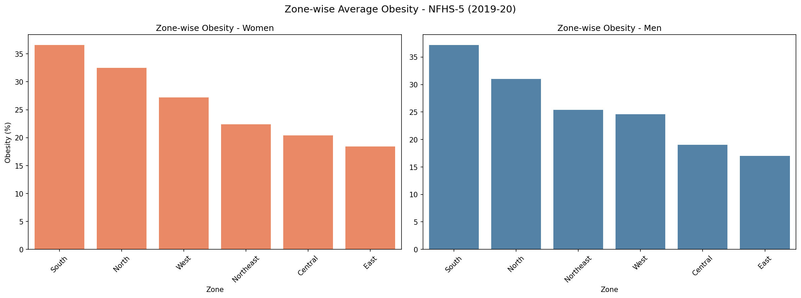

### State Analysis
- Puducherry has highest women obesity (46.2%)
- Andaman & Nicobar Islands has highest men obesity (45.3%)
- Meghalaya has lowest obesity for both genders
- Union Territories dominate top obesity rankings for men — UTs are more urbanized with higher income and sedentary lifestyle

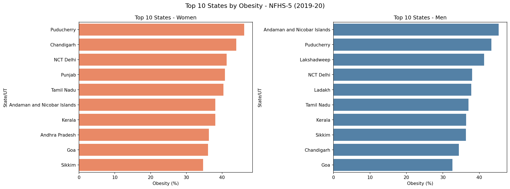

### Socioeconomic Factors
- Education shows strongest positive correlation with obesity (r = 0.76 women, r = 0.74 men) — higher education leads to 
  desk jobs and sedentary lifestyle
- Income positively linked to obesity (r = 0.63 women, r = 0.64 men) — higher income means more access to 
  processed food
- Internet usage linked to obesity (r = 0.60 women, r = 0.61 men) — more screen time means less physical activity

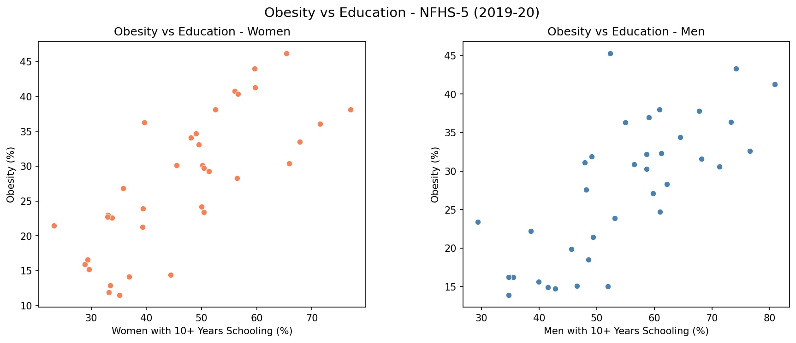
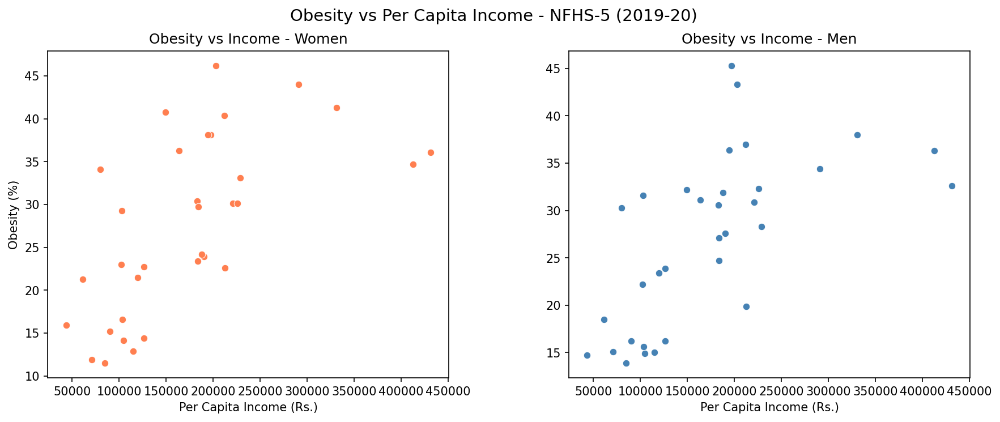
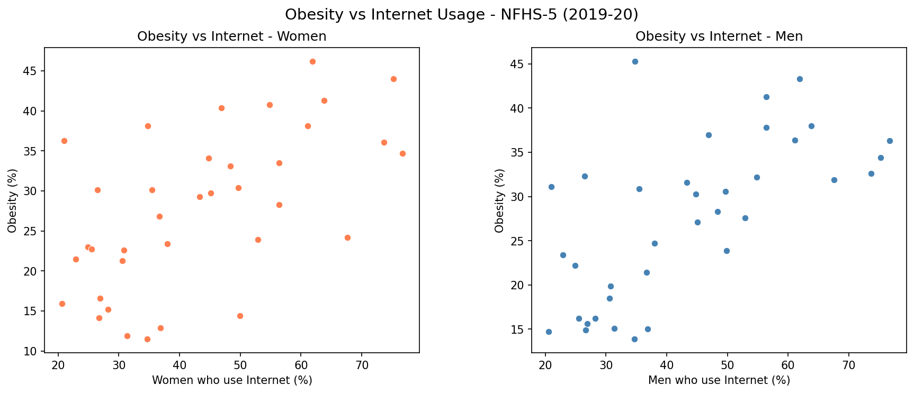

### Lifestyle Factors
- Tobacco shows strong negative correlation with obesity (r = -0.28 women, r = -0.67 men) — high tobacco states 
  are typically rural with more physical activity and lower income
- Alcohol shows no significant correlation with obesity — alcohol consumption patterns vary independently of obesity levels

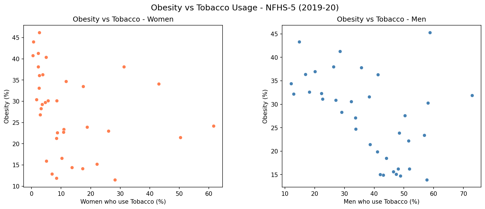

### Health Outcomes
- Blood sugar positively associated with obesity (r = 0.63 women, r = 0.36 men) — obesity is a known 
  risk factor for type 2 diabetes
- Blood pressure positively associated with obesity (r = 0.61 women, r = 0.56 men) — excess body fat 
  forces the heart to pump harder increasing cardiovascular strain and blood pressure

### Overall Correlation Summary
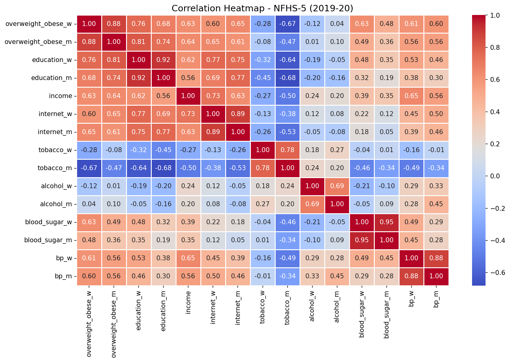

## Dashboard Preview

### Overview
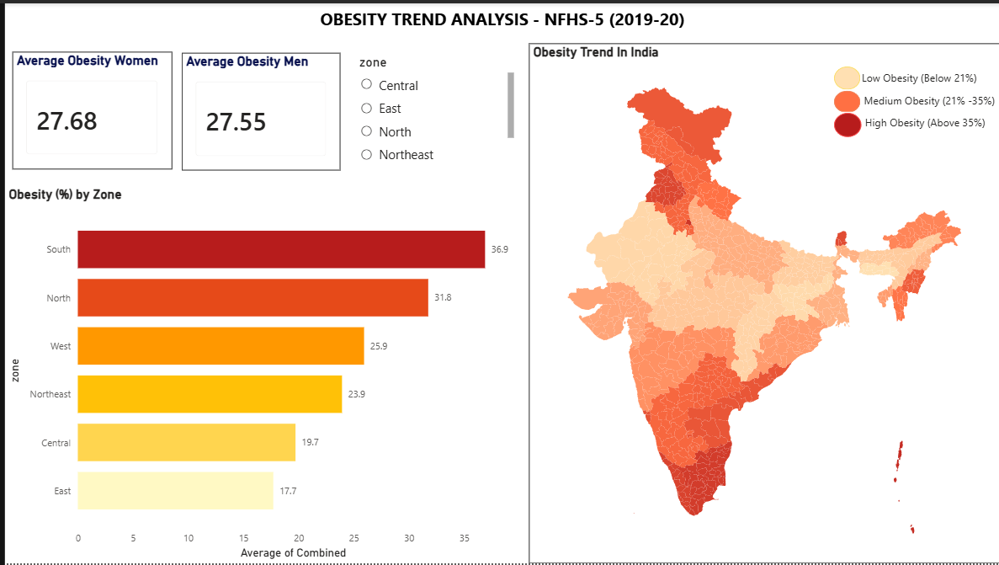

### State Wise Analysis
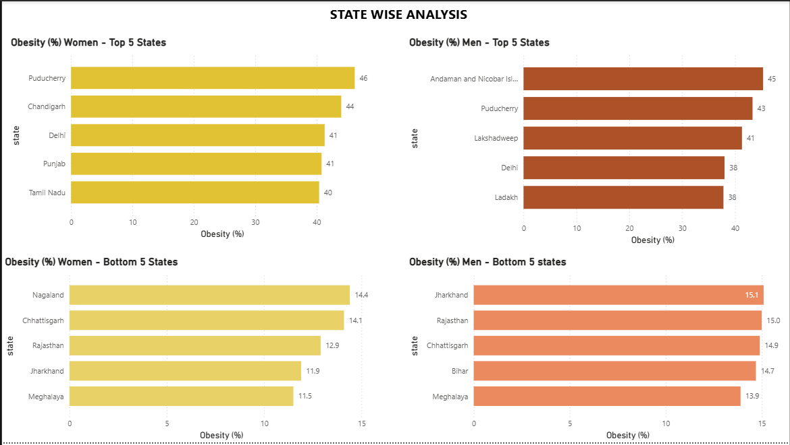

### Factor Analysis - Women
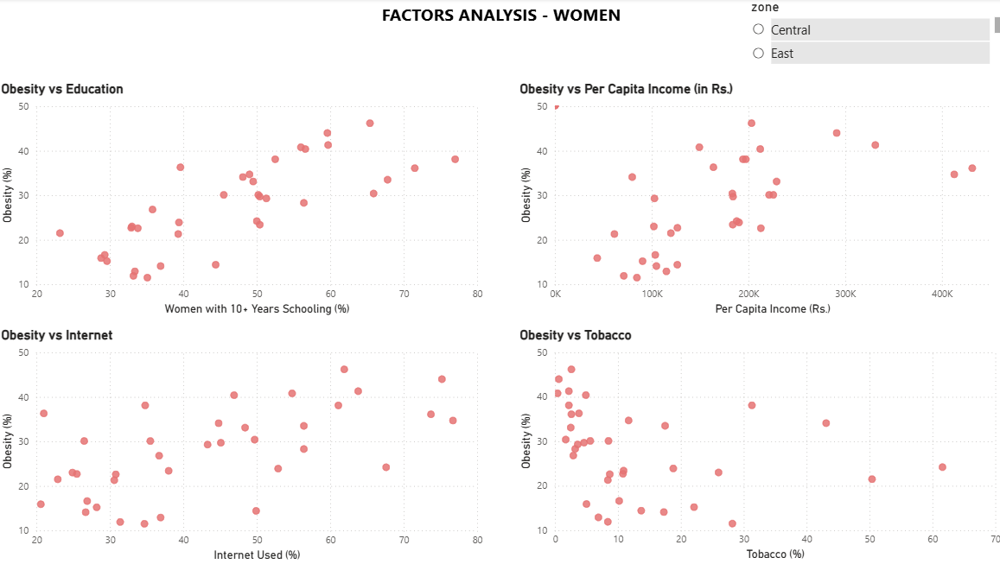

### Factor Analysis - Men
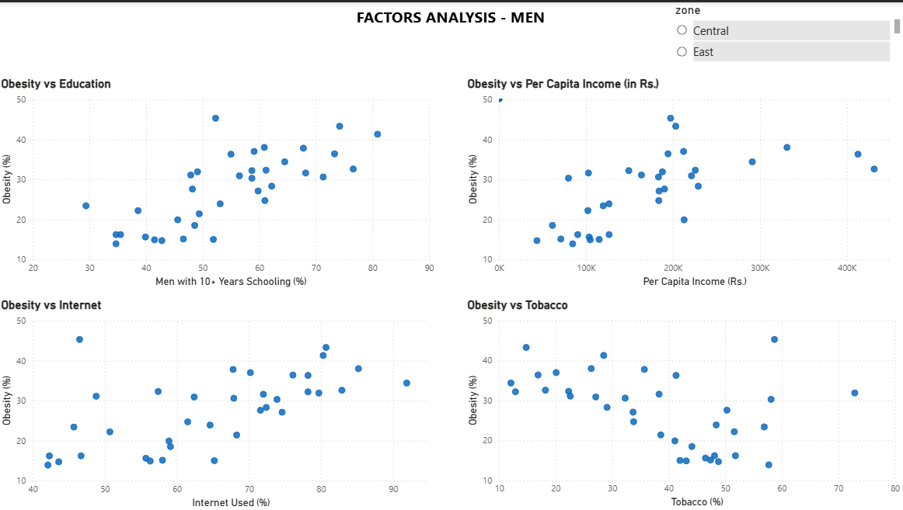

### Health Outcomes
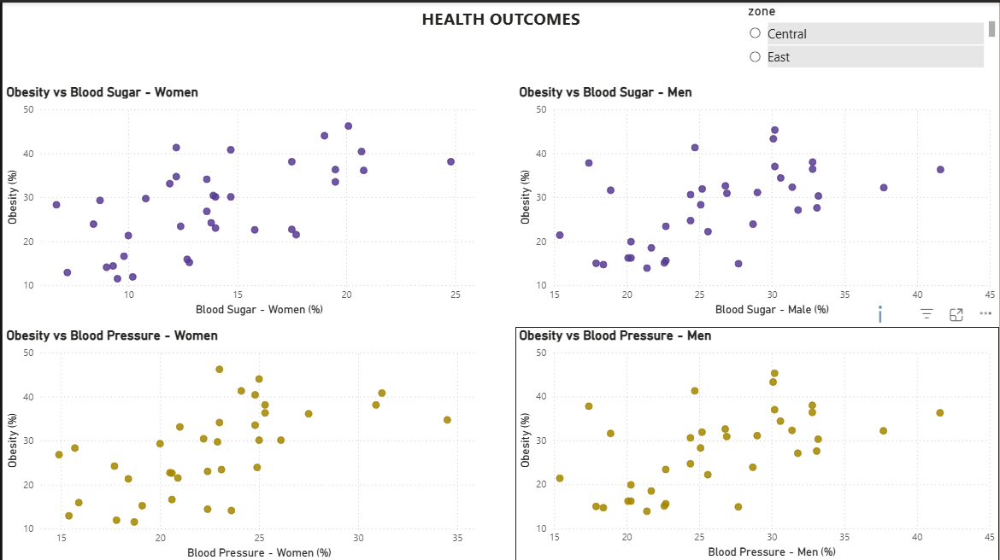

### Key Findings
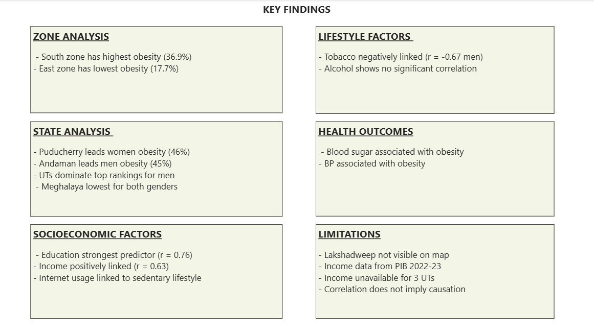

## Project Structure

```
OBESITY_ANALYSIS/
│
├── dashboard/                    
│   ├── 01_overview.png
│   ├── 02_state_analysis.png
│   ├── 03_factors_women.png
│   ├── 04_factors_men.png
│   ├── 05_health_outcomes.png
│   └── 06_insights.png
│
├── data/
│   ├── processed/                
│   │   └── obesity_cleaned.csv
│   └── raw/                      
│       └── Obesity_Analysis.xlsx
│
├── images/                    
│   ├── correlation_heatmap.png
│   ├── obesity_vs_education.png
│   ├── obesity_vs_income.png
│   ├── obesity_vs_internet.png
│   ├── obesity_vs_tobacco.png
│   ├── top10_obesity.png
│   └── zone_obesity.png
│
├── notebook/                    
│   ├── 01_cleaning.ipynb
│   ├── 02_eda.ipynb
│   └── 03_visualization.ipynb
│
├── power_bi/                     
│   └── obesity_trend.pbix
│
├── README.md                     
└── requirements.txt              
```

## Tools & Technologies

| Tool | Purpose |
|---|---|
| **Python** | Data Cleaning, EDA, Visualization |
| **pandas** | Data Manipulation and Analysis |
| **matplotlib** | Data Visualization |
| **seaborn** | Statistical Data Visualization |
| **Jupyter Notebook** | Interactive Coding Environment |
| **Microsoft Power BI** | Interactive Dashboard |
| **Microsoft Excel** | Data Collection and Storage |
| **VS Code** | Development Environment |

## Requirements

Python 3.8 or higher is required to run the notebooks.

Install all required packages using:

```bash
pip install -r requirements.txt
```

## How to Run

1. Clone the repository
```bash
git clone https://github.com/Manashvi-Ishita/obesity_trends_india.git
```

2. Navigate to project folder
```bash
cd obesity_analysis
```

3. Install required packages
```bash
pip install -r requirements.txt
```

4. Open Jupyter Notebook
```bash
jupyter notebook
```

5. Run notebooks in order:
   - `notebook/01_cleaning.ipynb` — Data cleaning
   - `notebook/02_eda.ipynb` — Exploratory data analysis
   - `notebook/03_visualization.ipynb` — Visualizations

6. For Power BI Dashboard:
   - Open `power_bi/obesity_trend.pbix` in Microsoft Power BI Desktop

## Limitations

### Data Limitations
- Income data from PIB 2022-23 does not match NFHS-5 survey period (2019-20)
- Income data unavailable for Ladakh, Lakshadweep and Dadra & Nagar Haveli
- NFHS-5 reports combined overweight/obese indicator (BMI ≥25) — overweight and obese cannot be separated

### Methodology Limitations
- Correlation does not imply causation
- Tobacco and alcohol age group (15+) differs slightly from obesity measurement age group (15-49)
- Zone classification based on Zonal Councils — Andaman & Nicobar and Lakshadweep are special invitees to South zone

### Visual Limitations
- Lakshadweep not visible on Power BI map due to small geographic size
- Andaman & Nicobar appears as thin lines on map

### Scope Limitations
- State level analysis only — district level patterns not explored
- No time trend analysis — single survey period only
- Physical activity data not available in NFHS-5 fact sheets

## Future Scope

- **Time Trend Analysis** — Compare NFHS-4 (2015-16) with NFHS-5 (2019-20) to analyze obesity trends 
  over time across states

- **Machine Learning** — Build a predictive model to identify states at risk of rising obesity based on 
  socioeconomic indicators

- **Physical Activity Data** — Incorporate physical activity indicators if made available in future 
  national health surveys

## Author
**Manashvi Ishita**
- GitHub: [Manashvi-Ishita](https://github.com/Manashvi-Ishita)
- LinkedIn:[Manashvi Ishita](https://www.linkedin.com/in/manashvi-ishita)